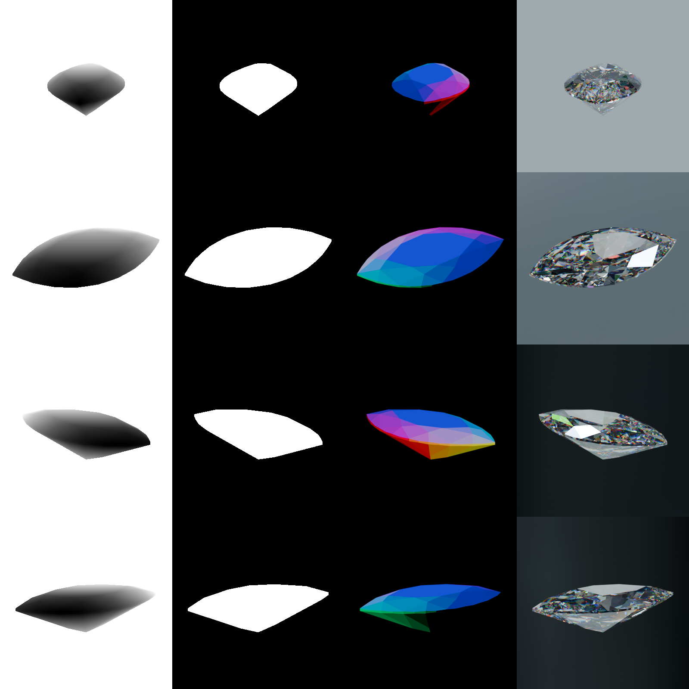

# Plugin System

This project ships with a **config‑driven plugin system** that lets you bolt new functionality onto the rendering pipeline without touching the main script.  Every plugin lives in the `plugins/` folder and subclasses `IPlugin` (defined in `plugins/__init__.py`).

## Enabling / disabling plugins

Edit `config.toml`:

```toml
[plugins]
enabled = [
  "mask",                      # mask for each view
  "normal",                    # normal map for each view
  "camera_projection_matrix",  # 3×4 projection matrix,
  # add or remove plugin names here
]
```

* **Add** a plugin name → it is imported and its hooks run.
* **Remove** a name → plugin is skipped (files remain under version control).

## Authoring a plugin – 30 s recipe

```python
# plugins/myplugin.py
from plugins import IPlugin

class MyPlugin(IPlugin):
    def on_scene_created(self, scene, output_dir):
        print("Hello, scene!")
    def on_camera_created(self, scene, camera, idx, output_dir):
        print(f"Rendering view {idx}")
    def on_another_render_completed(self, scene, camera_obj, index, output_path):
        print(f"View {idx} is rendered")
    def on_rendering_completed(self, scene):
        print("All rendering is complete!")

```

1. Drop the file into `plugins/`.
2. Add `"myplugin"` to `[plugins].enabled`.
3. Run the script.

---

## Present plugins

| Module name                  | Purpose                                                                                                     | Output files                         |
| ---------------------------- | ----------------------------------------------------------------------------------------------------------- | ------------------------------------ |
| **mask**                     | Generates an object **mask** using Object‑Index pass.                                                       | `###_mask_###.png`                   |
| **normal**                   | Saves **normal maps** (world space) for each view.                                                          | `###_normal_###.png`                 |
| **depth**                    | Writes **Z‑depth** maps.                                                                       | `###_depth_###.png`                  |
| **camera_projection_matrix**               | Stores the 3 × 4 **projection matrix** per image.                | `###_camera_projection_matrix.json` |
| **normalization\_matrix**     | Computes matrix that maps the scene’s bounding‑box into the unit sphere (IDR convention).         | `normalization_matrix.json`                     |
| **masked**                   | Creates transparent‑background RGB images where the object is retained and all other pixels are α=0.           | `###_masked_###.png`                 |
| **bounding\_box**            | Saves the scene **bounding box** and an initial voxel size to `bbox.txt`; supports regex‑based object exclusion. | `bounding_box.txt`                          |
| **camera\_intrinsics**       | Writes 3x3 camera intrinsic matrix.                         | `camera_intrinsics.txt`                     |

## Examples

Here are `depth`, `mask`, `normal` plugins in work.



---

## FAQ

| Question                                             | Answer                                                                                                |
| ---------------------------------------------------- | ----------------------------------------------------------------------------------------------------- |
| *Where must plugins live?*                           | **Always** inside the `plugins/` directory so Python’s import machinery and the loader can find them. |
| *Can a plugin add new config keys?*                  | Yes—read them from the `cfg` dict you receive in the constructor.                                     |
| *Do plugins run in a defined order?*                 | They are instantiated in the order they appear in `config.toml`.                                      |

