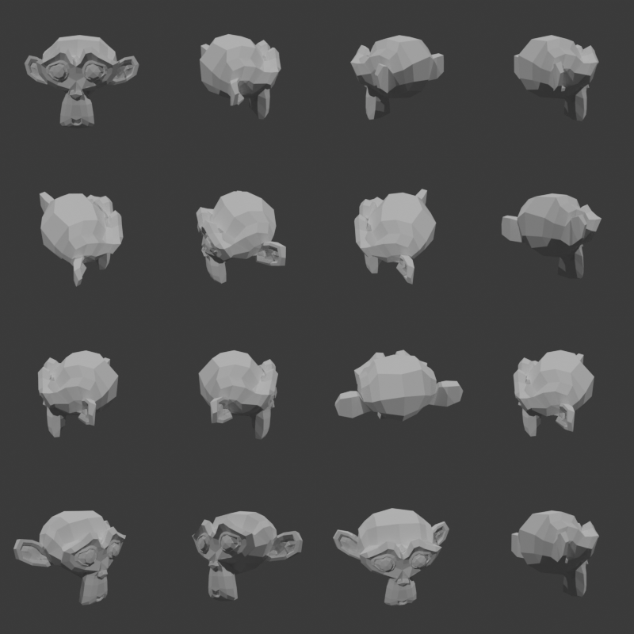

# Generate Learning-based Multi-view Stereo dataset using Blender Python API

As it states in [Blender's Python API Overview](https://docs.blender.org/api/current/info_overview.html)

> Blender has an embedded Python interpreter which is loaded when Blender is started and stays active while Blender is running.

We'll use Blender' Python interpreter to depend only on Blender version.
If this does not fit your needs, see [how to use system python](https://docs.blender.org/api/current/info_tips_and_tricks.html#bundled-python-extensions). One can also [build blender into a python module](https://developer.blender.org/docs/handbook/building_blender/python_module/).

These scripts were tested on
```
❯ blender.exe --background --python-expr "import sys; print(sys.version)"
Blender 4.2.9 LTS (hash a10f621e649a built 2025-04-15 01:46:41)
3.11.7 (main, Jun 11 2024, 12:31:01) [GCC 11.2.1 20220127 (Red Hat 11.2.1-9)]

Blender quit
```

---
## Examples

See help
```
Blender 4.2.9 LTS (hash a10f621e649a built 2025-04-15 01:46:41)
usage: blender [-h] model_path output_directory [number_of_renders]

Script for generating rendered images of a 3D model using Blender, driven by config.toml.

positional arguments:
  model_path         Path to the 3D model file (OBJ, FBX, glTF, GLB).
  output_directory   Directory where the rendered images will be saved.
  number_of_renders  Number of images to generate per run.

options:
  -h, --help         show this help message and exit
```

1. Export monkey mesh Suzanne from `blender` as `.glb` (or download it [here](https://sketchfab.com/3d-models/suzanne-blender-monkey-29a3463e8d314c8fbda620800019cfb9))
1. To generate one image into `output` directory use

	```sh
	blender --background --python generate-batch.py -- suzanne.glb ./output
	```

1. See result in `output` directory

	

1. To generate 16 images from random locations into `output` directory use

	```sh
	blender --background --python generate-batch.py -- suzanne.glb ./output 16
	```

1. See result in `output` directory[^1]

	

---
## Configuration

Script provides extensive configuration, see [config.default.toml](config.default.toml).

Dumping the parsed config

	```bash
	blender --background --python generate-batch.py -- --dump-config
	```

---
## Plugins

See [PLUGINS.md](PLUGINS.md).

---
## Compatibility

The `compat/` directory contains helper scripts to restructure the output of this Blender dataset generator into formats compatible with popular neural rendering and 3D reconstruction frameworks:

### Available Converters:
1. **COLMAP** - Converts to standard COLMAP structure (images/, sparse/)
   ```bash
   python compat/to_colmap/to_colmap.py <input_dir> <output_dir>
   ```
2. **NSVF** - Prepares data for Neural Sparse Voxel Fields pipeline
   ```bash
   python compat/to_nsvf_dataset/to_nsvf_dataset.py <input_dir> <output_dir>
   ```
3. **IDR** - Formats data for Implicit Differentiable Renderer requirements
   ```bash
   python compat/to_idr_dataset/to_idr_dataset.py <input_dir> <output_dir>
   ```

---

Note: on headless systems (like WSL) before running you are required to set these environmental variables to be able to run on CPU.
```bash
export LIBGL_ALWAYS_SOFTWARE=1
export MESA_LOADER_DRIVER_OVERRIDE=llvmpipe
```

Note: as it seems for now there is no support for in memory rendering. Sources:
* https://stackoverflow.com/a/58948767/15751315
* https://devtalk.blender.org/t/is-it-possible-to-store-keep-the-rendering-result-in-memory-only-and-avoid-doing-i-o/11852/2
* https://blender.stackexchange.com/q/289920

So, to speedup performance it is recommended to use RAMDISK,
* On Linux, according to [this tutorial](https://web.archive.org/web/20180123110848/http://ubuntublog.org/tutorials/how-to-create-ramdisk-linux.htm)
```bash
sudo mkdir -p /media/generatormeta
sudo mount -t tmpfs -o size=1024M tmpfs /media/generatormeta/
```
* On Windows using [ImDisk](https://imdisktoolkit.com/).

[^1]: this grid was made with [this](scripts/grid/)
