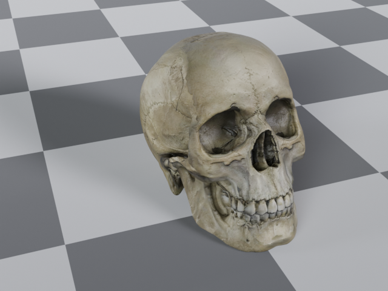

# checkerboard.py

Create a **single mesh plane** at the world origin and give it a **Diffuse BSDF** material whose colour is a checkerboard pattern (roughness = 1, checker scale = 10).  
Nothing else in the current scene is touched.

---

## Requirements

| Software | Version |
|----------|---------|
| Blender  | 2.80 + (works in 3.x / 4.x just the same) |
| Python   | Included with Blender (no external installs) |

The script relies solely on Blender’s built‑in `bpy` module; no extras needed.

---

## How to run the script *inside the Blender UI*

1. **Open your .blend** (or start a new scene).  
2. Switch to the **Scripting** workspace *(or open a Text Editor area)*.  
3. Click **New** to create an empty text block, then **paste** the script contents.  
4. Hit **Run Script** (or press `Alt + P`).  
   *A new object called **Plane** appears at `(0, 0, 0)` with a material called **CheckerDiffuse** applied.*  
5. Tweak the material if you like:  
   * In the **Shader Editor**, select the plane’s material.  
   * Adjust the **Checker Texture → Scale** or the **Diffuse BSDF → Roughness** sliders.

> **Tip:** If a plane named “Plane” already exists, Blender will rename the new one to “Plane.001”, “Plane.002”, … so you can run the script multiple times without collisions.

---

## Example

